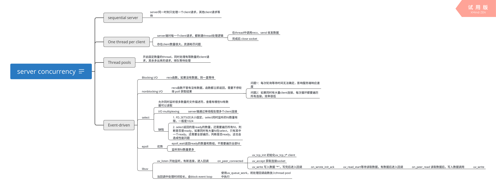

# server concurrency

> 参考链接：https://eli.thegreenplace.net/2017/concurrent-servers-part-1-introduction/

## sequential server

### server同一时刻只处理一个client请求，其他client请求等待

## One thread per client

### server端对每一个client请求，都新建thread处理逻辑

* 在thread中调用recv、send 收发数据
* 完成后 close socket

### 存在client数量很大，资源耗尽问题

## Thread pools

### 开启固定数量的thread，同时处理有限数量的client请求，其余多出来的请求，排队等待处理

## Event-driven

### Blocking I/O

* recv函数，如果没有数据，则一直等待

### nonblocking I/O

* recv函数不管有没有数据，函数都立即返回，需要不停轮询 poll 获取结果
  * 问题1：每次轮询等待时间无法确定，影响服务端响应速度
  * 问题2：如果同时有大量client连接，每次循环都要遍历所有连接，效率很低

### select

* 允许同时监听很多数量的文件描述符，查看有哪些fd有数据可以读取
* I/O multiplexing
  * server端通过单线程处理多个client连接
* 缺陷
  * 1. FD_SETSIZE大小固定，select同时监听的fd数量有限，一般是1024 
  * 2. select返回的是ready的数量，还需要遍历所有fd，判断是否是ready，如果同时有大量fd在select，只有其中一个ready，还需要全部遍历，判断是否ready，这也会造成性能问题

### epoll

* 优势
  * epoll_wait返回ready的数量和数组，不需要遍历全部fd
  * 监听到fd数量更多

### libuv

* uv_listen 开始监听，有新连接，进入回调
  * on_peer_connected
    * uv_tcp_init 初始化uv_tcp_t* client
    * uv_accept 获取连接socket
    * uv_write 写入数据 "*"，写完后进入回调
      * on_wrote_init_ack
        * uv_read_start等待读取数据，有数据后进入回调
          * on_peer_read 读取数据后，写入数据调用
            * uv_write
* 当回调中处理时间较长，会block event loop
  * 使用uv_queue_work，将处理回调函数放入thread pool中执行

*XMind: ZEN - Trial Version*
